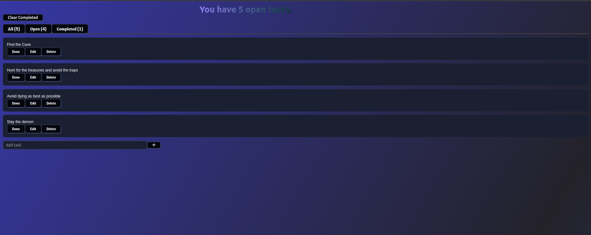

# Todo2 App

A simple, clean Todo List application built with **React**, featuring:

- Add, update, complete, and delete todos
- Tab filtering between **Open** and **Completed**
- Data persistence using **localStorage**
- Background music (starts on first click anywhere)
- Fun animated background gradient

---

## 📸 Screenshot
<!-- Replace with actual screenshot path after you add it -->


---

## 📂 Source / Tutorial
This project is based on a tutorial by [jamezmca](https://github.com/jamezmca) on YouTube.  
I added:
- Background music and sound effects
- Animated gradient background
- Minor UI tweaks

---

## 🚀 Installation & Usage

1. **Clone the repository**:
   ```bash
   git clone https://github.com/YOUR-USERNAME/todo2-app.git
   cd todo2-app